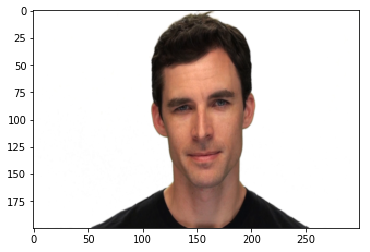
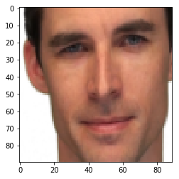
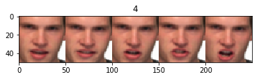
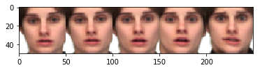

# Emotion-Recognition-using-Spatio-Temporal-Data
Emotion Recognition using Spatio-Temporal Data, applied on REVDESS Dataset, to predict 8 emotion, based on the Video(Spatio) and Audio(Temporal) Data.
* It is a multi-modal learning:
  * Where for the Spatial features a Convolutional Neural Networks are used.
  * For the Audio Temporal Data a variant of RNN called LSTM is used.
### Preprocessing the Spatio-Temporal data before feeding it to the model.
* For Spatial data: 
  * Video feed of 30 frames per second: We have 30 images per second. 
  * Uniformly sampled 5 images per second at regular intervals, like this. 
  
  * So, Each image has a lot of white and unused space. So, as we need only the facial features of the person, I've applied Face Recognition to get the localised coordinated of the face and cropped the image to have only the face. 
  
  * Now, To ge the sequential richness of the video in a single image, all the five images are stitched horizontally in order to make a strip of images. 
  
  
  * Noe, We have this strip of image per each second of the video, where we have the sequential information ina single image where we can run a CNN over the single image.
* For Audio Temporal Data:
 * We have the audio in two formats, Speech and Songs for each emotion for each actor.
 * The sampling rate of the audio files is 44100Hz, But as human's peaking frequency lies in between 0-8000Hz we can can down sample the audio to 16000Hz considering the Nyquist criterion. I've used the Librosa to load and down sample the wav files.
 * The Audio data when feeding into the model is converted into MFCCs(Mel-Frequency Cepstral Coefficients), this Wav to MFCC conversion is also coded over CUDA enabled Tensorflow so, we can parallelize that part as well. 
 * Now, The Audio MFCCs can be given to an LSTM where the final latent space vector (Hidden layer) is obtained.
 
 ## Actual Model:
 * The latent space vector from the images through CNNs (200dims) is obtained from the model1 and the latent spcae vector from the LSTMs (2oodims) is obtained from the model2. These two vectors are concatenated to get a 400dims vector, and that concatenated vector is given to a fully connected layer to predict the emotion class(C=8).
 * The model is trained on 80% of the randomly shuffled data and velidated on the remaining 20% 
 This model converged and performed pretty well on the Validation dataset also.
 
 Thank you for Reading.. 
 Best,
 Abhishek
